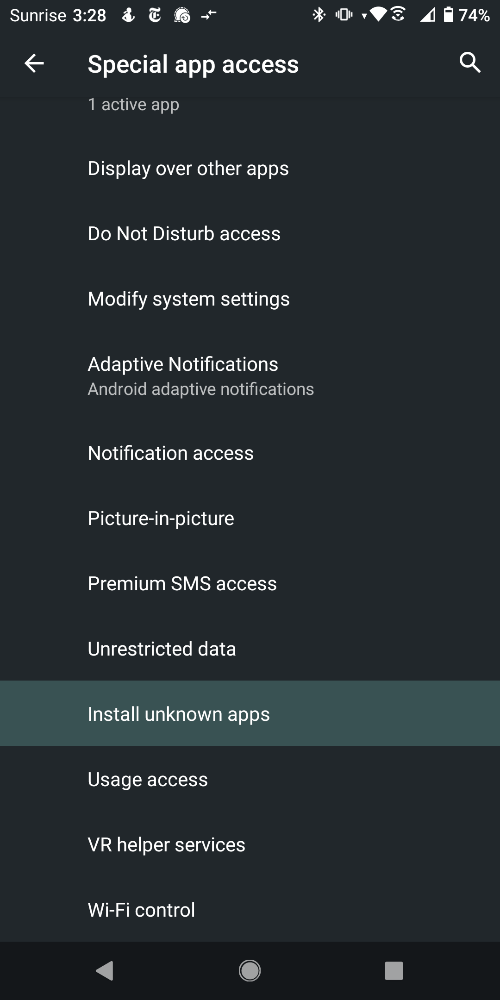

# **Trusted Introductions for the Signal private messenger**

Welcome!

This page is your point of entry for the research project building Trusted Introductions for the Signal private messenger.

This project is executed at the [Network Security group](https://netsec.ethz.ch/) of ETH Zürich and funded by the Werner Siemens Foundation through the [Centre for Cyber Trust](https://cyber-trust.org/).

If you want to submit feedback or have questions about the project, feel free to get in touch with the [project lead](https://people.inf.ethz.ch/cgloor) directly or to fill out our [form](/pages/feedback/feedback.html) .

(potential) participants of the Android user study may download the concise information sheet [here](/pdfs/Information_sheet.pdf).

##  **Table of contents**

  - [**Considerations before installing the application**](#considerations-before-installing-the-application)
  - [**Ressources**](#ressources)
    - [**HowTos**](#howtos)
      - [**Backup your Signal Data**](#backup-your-signal-data)
      - [**Verify your backup**](#verify-your-backup)
      - [**Verify your PIN**](#verify-your-pin)
      - [**Install the modified application**](#install-the-modified-application)
        - [**Which of the five files is right for my phone?**](#which-of-the-five-files-is-right-for-my-phone)
          - [**TLDR;**](#tldr)
          - [**More information**](#more-information)
      - [**Transfer your Signal Data**](#transfer-your-signal-data)
        - [**Relink your connected devices**](#relink-your-connected-devices)
      - [**Use Trusted Introductions**](#use-trusted-introductions)
      - [**Move to a new version of the APK**](#move-to-a-new-version-of-the-apk)
      - [**Move back to a normal installation of Signal**](#move-back-to-a-normal-installation-of-signal)
    - [**Source Code**](#source-code)
      - [**Android**](#android)
      - [**Telemetry Server**](#telemetry-server)
    - [**Newest APK download & Change Log**](#newest-apk-download--change-log)
      - [**Change Log**](#change-log)
        - [**2.1.2:**](#212)
        - [**2.1.1:**](#211)
        - [**2.1.0:**](#210)
        - [**2.0.2:**](#202)
        - [**2.0.1:**](#201)
        - [**2.0.0:**](#200)

## **Considerations before installing the application**

- This process will require creating and restoring from backups. To store the backups, your smartphone will need some free storage space (at least 2x as much as your Signal data is using).
- dataloss may occur if the backup process is not done carefully.
- if you have registration lock enabled, you MUST know your PIN before attempting to transfer your data or you may lock yourself out of your account for a week. If you don't know your PIN, disable registration lock and optionally reenable it while carefully saving your PIN.
- if you have been using Signal together with a linked desktop application, it may take a while until you can relink the desktop application. Messages exchanged while the desktop was not linked will not synchronize, but you will not loose your history if you follow the instructions. 
- while some telemetric measurements are planned for an upcoming study, the current APKs **do not** contain any kind of telemetry.

## **Ressources**

### **HowTos**
#### **Backup your Signal Data**
Open Signal on your Android smartphone and navigate to the settings, from there open the "Chats" setting.

|  |  |
| ------------- | ------------- |
|   |   |

From here, navigate to "Chat backups" and turn on backups. You will now be asked to choose a location on your smartphone for Signal to store you backups in. Choose a folder and make sure to note which one it is. 

**Please be aware that you will need a significant amount of free storage on your smartphone if Signal is your main messaging application, since the backups will include all the media sent and received through the application. While testing we got backups that were a few GB in size. This will depend on the content of your chats. For example, your backup will be significantly larger if you send a lot of video through the application.**

|  |  |  |
| ------------- | ------------- | ------------- |
|   |   |   |

Once backups are turned on, you can force an immediate backup by tapping "Create backup". The next screen will show you the backup passphrase. You can copy it into the clipboard by long tapping on the passphrase. **Make sure that you save this passphrase carefully, it is needed to decrypt your backup file. If you loose it, there is no way to restore it and your backups will not be usable.** On success, a progress bar will appear.

|  |  |  |
| ------------- | ------------- | ------------- |
|   |   |   |

Once the backup is completed, we suggest immediately copying it and storing a second copy somewhere, for example on your laptop.

#### **Verify your backup**

Before installing the modified application make sure that you have a working backup of your data and the corresponding passphrase. You can check that this is the case through the Signal application. Navigate to the "Chat backups" screen and tap "Verify backup passphrase", the application will let you know if you have the correct passphrase or not. If you don't succed, turn off backups and redo all the backup steps to create a new backup and passphrase.

|  |  |  |  |
| ------------- | ------------- | ------------- | ------------- |
|   |   |   |    |

#### **Verify your PIN**

Be aware that if you have registration lock enabled, you MUST know your PIN before you uninstall the Signal application or you may temporarily lock yourself out of your account when restoring from backup. You can check if you have the correct PIN in the settings. Navigate to "Account", then turn on the PIN reminders if you don't have them turned on. Now, if you attempt to flip that switch again to turn them off, Signal will ask you to confirm your PIN. If you have the correct PIN you can move on, otherwise either change your PIN to a new one or you can turn off the PIN all together in the "Advanced PIN Settings".

|  |  |  |  |
| ------------- | ------------- | ------------- | ------------- |
|   |   |   |    |

Once you are certain that you have a working backup and passphrase and that you know your PIN or the PIN is disabled, you can download the modified application and install it as described in the [**Install the modified application**](#install-the-modified-application) section.

#### **Install the modified application**
You can download the newest APKs for Android smartphones [here](https://polybox.ethz.ch/index.php/s/K9mgiDihWqj9dIC) . When downloading the files, your smartphone will warn you that the file may be harmful. This is because Android expects all applications to be downloaded via. the Google PlayStore. Since this is coming directly from us and not through the store, Google did not check the file for malicious code and hence you see the warning. It is safe to download the file anyway. 

Please be aware that Signal will not let you load a backup from an older version of Signal. So before you proceed, check the last version number against your version of Signal.

You can find the version of Signal you are running by navigating to the "settings", and scrolling down and tapping on "Help", where the Version will be listed.

|  |  |  |
| ------------- | ------------- | ------------- |
|   |   |   |

If the version of Signal you are running on your smartphone is newer than the Signal version of the APK, you must wait for the new APK to be uploaded. We synchronize regularly, but if you find yourself stuck because the newest APK has not been uploaded yet, feel free to [reach out and let us know](https://people.inf.ethz.ch/cgloor) so we can speed up the process.

##### **Which of the five files is right for my phone?**

###### **TLDR;**

Before doing anything, **make sure that you have backed up your chats, or you may loose all of your data irreversibly!** You can do this by following the instructions in chapters [**Backup your Signal Data**](#backup-your-signal-data) and [**Verify your backup**](#verify-your-backup) and [**Verify your PIN**](#verify-your-pin).

After having backed up and verified your data, you must uninstall your current version of Signal.

You can then simply try to install the files in the following order:
1. _arm64_v8a_
2. _x86_64_
3. (if your phone is very old, _armeabi-v7a_ or _x86_)
4. if all else fails: _universal_, this should work with most phones but will use more storage

You will have to allow the application from which you access the APK (e.g., a browser or your file manager) to "install unknown apps" in the settings. To do this simply follow the banner to the settings and enable the option.

|  |  |
| ------------- | ------------- |
|   |   | 

If an installation fails, your phone will simply tell you that Signal could not be installed and you can move to the next file.

|  |  |  |
| ------------- | ------------- | ------------- |
|   |   |   |

We recommend retracting the "Install unknown apps" permission as soon as your installation is done. To do this search for "Install unknown apps" in the settings, navigate to the application you used to access the APK and remove the permission by flipping the switch again.

|  |  |  |  |
| ------------- | ------------- |------------- |------------- |
|   |   |   |   | 

It is possible that none of the installers work for your device. In that case you will unfortunately not be able to participate in the study.

###### **More information**

The correct file will depend on the processor type that is in your smartphone. The different names denote different _instruction sets_ that a processor might use. Most commonly, Android phones use the ARM CPU architecture, more rarely, you might find an x86 architecture. 
You can google for your processor and then find which CPU cores it contains.
The more direct way is through a third party app, as this information is not commonly listed in the native Android settings. For example, [DevCheck](https://play.google.com/store/apps/details?id=flar2.devcheck) easily exposes what kind of CPU cores the processor contains. 
After finding the type of CPU, you will still need to google for the instruction set.

#### **Transfer your Signal Data**
Once you have successfully installed the APK you will need to load the data out of your backup into the modified application and reregister your mobile phone number with your account (and maybe input your Signal PIN if it was enabled).
When opening the modified application for the first time, give it the permissions it needs to function like you did when installing the unmodified Signal application, and navigate to "Transfer or restore account".

|  |  |  |  |
| ------------- | ------------- | ------------- | ------------- |
|   |   |   |    |

From there pick "Restore from backup", choose the backup file tap "Restore backup" and input your passphrase. If you have the correct passphrase, a progress indicator will appear. If you make a mistake the application will tell you and you can try again.

|  |  |  |  |
| ------------- | ------------- | ------------- | ------------- |
|   |   |   |    |

After your data is loaded, set a folder to store future backups in. Afterwards, you will need to reregister with your phone number as you did when you first installed the Signal application. This is where you may need your PIN. Be careful here if you had registration lock enabled, as inputting the wrong PIN too many times will temporarily lock you out of your account.

|  |  |
| ------------- | ------------- |
|   |   |

##### **Relink your connected devices**

 If you used the Signal desktop client, you will notice that it is no longer linked to your account after restoring the backup. In order to relink your device, you will need close the desktop application and reopen for the "Unlinked" banner to appear. **Note: it may a significant amount of time after you loaded your backup into your mobile phone and more than one restart of the desktop application for this banner to appear.**

 |  |  |
| ------------- | ------------- |
|   |   |

In your smartphone, navigate to the "settings" and "Linked devices" and tap the + icon to scan the code on your desktop and link the devices again. 

|  |  |  |
| ------------- | ------------- | ------------- |
|   |   |   |

After scanning the code the desktop client will display a progress bar until the synchronisation is complete. 

|  |  |
| ------------- | ------------- |
|   |  |

#### **Use Trusted Introductions**

This logo indicates the trusted introductions feature:

You will also notice that there are now more verification states, and that these states are always shown below the avatar and name of your counterparty in the conversation view. Your contacts can have one of these verification states:

- _**Unverified**_ if you have either never interacted with this contacts verified state before or have specifically set it to unverified, either manually by tapping "clear verification" in the "View safety number screen" or through rejecting all introductions that you got for this contact.
- _**Manually Verified**_ if you have tapped the "set manually verified" button on the "Verify safety number" screen. This is the weakest form of verification and does not unlock any trusted-introductions features for this contact.
- _**QR Verified**_ indicating that you have scanned the QR code in the "View safety number" screen of your conversation.
- _**Introduced**_ indicating that you have accepted an introduction for this contact.
- _**Strongly verified**_ indicating that you have scanned the QR code and accepted at least one introduction for this contact.

You can initiate an introduction the same way you would forward a contact, in the menu which pops up when tapping the "+" in the conversation view.
Please be aware that you can only introduce people to someone that you have either directly verified by scanning the conversation QR-code, or have accepted an introduction for. Additionally, you can only introduce contacts for which you have directly scanned the QR-code of your conversation. The application will let you know if you are trying to do something that is not allowed and will tell you how to remedy it.

|  |  |
| ------------- | ------------- |
|   |  |

Once you have contacts that have a strong enough verification state, you will be able to choose which _QR Verified_ or _Strongly Verified_ contacts you want to introduce.

 

 After someone sent you an introduction, you can navigate to the management screen by tapping on their profile picture, then "Trusted Introductions". Here you can interact with the introductions that this contact has forwarded to you or navigate to the screen which shows all the introductions you have received.

|  |  |  |
| ------------- | ------------- | ------------- |
|   |  |  |

#### **Move to a new version of the APK**

In this case, you will generally not need to export and import your data since you can simply do an update with the new APK. Check [**Newest APK download \& Change Log**](#newest-apk-download--change-log) to make sure that this is the case for the version you are trying to update to as some changes are breaking and will need you to backup, uninstall and reinstall. We still recommend making sure that you have a working backup before you do this, in case something unexpectedly goes wrong. Follow the steps detailed at [**Backup your Signal Data**](#backup-your-signal-data), [**Verify your backup**](#verify-your-backup) and [**Verify your PIN**](#verify-your-pin) to make sure you have a fallback option available.

Now, download the newest version of the APK that is compatible with your smartphone (see - [**Which of the five files is right for my phone?**](#which-of-the-five-files-is-right-for-my-phone)), and open it. You may have to grant the "install unknown apps" permission as detailed in the [**TLDR;**](#tldr) chapter.

|  |  |
| ------------- | ------------- |
|   |  |

#### **Move back to a normal installation of Signal**

This process is very similar to what you did to move from a normal installation to the modified application. The only difference is that you will have two backup files to choose from. The one labeled with "trusted-introductions" is compatible with the modified application, while the file without this text is compatible with the normal Signal application. Both files are encrypted with the same passphrase. Follow the steps detailed in [**Backup your Signal Data**](#backup-your-signal-data), [**Verify your PIN**](#verify-your-pin) and [**Transfer your Signal Data**](#transfer-your-signal-data) again and make sure that you use the correct file when reloading from your backup. **If you try to import a "trusted-introductions" backup, the unmodified Signal application will crash, since it does not know how to handle the introductions and extended verification states. If this happens, uninstall and reinstall the application from the PlayStore and use the correct backup file when you try again.**
The backup will collapse all the different verified states (_QR Verified_, _Introduced_, _Strongly Verified_ or _Manually Verified_) to the single "verified" state in the original application.

### **Source Code**

#### **Android**

The source code for the modified Android application is [here](https://github.com/Cerenia/Signal-Android/tree/trusted-introductions). A good starting point for getting acquainted with the modifications is to start looking at the files in this [folder](https://github.com/Cerenia/Signal-Android/tree/trusted-introductions/app/src/main/java/org/thoughtcrime/securesms/trustedIntroductions).

#### **Telemetry Server**

(This is meant for the future Android study, there will never be any telemetry in the APK outside of this timeperiod) 

When you install the modified Signal application you will be prompted to register with the telemetry server by providing a random word or string (salt). This value will be concatenated to your Signal user ID and hashed. The hash will be the pseudonym used to reidentify the same users without allowing the researchers to deanonymize the users. 
The pseudonym, and the salt will be listed in the applications help page, where you can also find the current version. 
If you ever opt to terminate your involvement with the study, you may request the deletion of your data using this [form](/pages/study/delete_data_form.html). Please consider providing the reason for aborting the study. This helps us reason about missing datapoints and what biases it may introduce to our data. 

Rest still TODO:
WIP

### **Newest APK download & Change Log**

**The prototype is currently being restructured and the APK are thus out of date.**

[APKs](https://polybox.ethz.ch/index.php/s/K9mgiDihWqj9dIC)

You can check which version of the Trusted Introductions APK you are currently running by navigating to "Settings" -> "Help".

#### **Change Log**

The commit history on Github has a more finegraned list of changes.

##### **2.1.2**
- Identity keys no longer sometimes get mixed up when doing bulk introductions

##### **2.1.1**
- Backup file for trusted introduction data displays correct timestamp

##### **2.1.0:**
- clarifying header on the screen for managing all introductions

##### **2.0.2:**
- TI parsing logic inserted into new message processor
- NPT, cursor & assertion bugfix

##### **2.0.1:**
- Adapted trusted introductions jobs to match new job datatype.

##### **2.0.0:**
- Checking for stale introductions before updating on security nr. change.
- Fixed erroneous datatype and removed unneccessary constraint in Introductions Database. **=> Requires a fresh installation instead of an upgrade for the changes to take effect (back up your data first).**